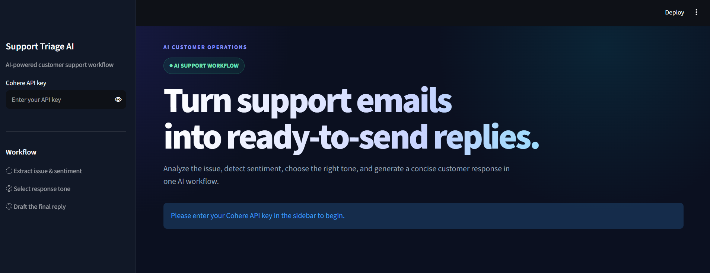
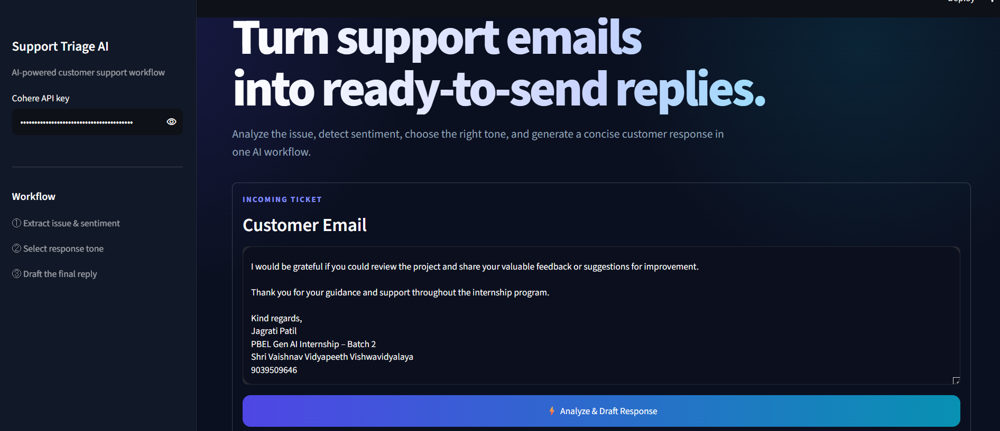
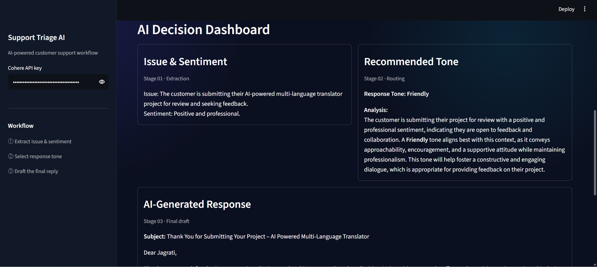

# Support Triage AI

An AI-powered customer support workflow built using **LangChain**, **Cohere**, and **Streamlit**.

This application analyzes customer emails, identifies the issue and sentiment, recommends an appropriate response tone, and generates a professional reply using a Sequential Chain workflow.

---

## Features

- Analyze customer support emails
- Extract issue and customer sentiment
- Recommend an appropriate response tone
- Generate AI-powered customer replies
- Modern Streamlit dashboard
- Cohere LLM integration
- SequentialChain workflow using LangChain

---

## Tech Stack

- Python
- Streamlit
- LangChain
- Cohere API
- Prompt Engineering

---

## Workflow

Customer Email
↓
Issue & Sentiment Analysis
↓
Response Tone Recommendation
↓
AI-Generated Response

---

## Installation

```bash
git clone https://github.com/achal-shukla/Support-Triage-AI.git
cd Support-Triage-AI

python -m venv .venv

# Windows
.venv\Scripts\activate

pip install -r requirements.txt

streamlit run app.py
```

---

# Screenshots

## Home Dashboard




## Customer Email Input




## AI Analysis & Generated Response




---

## Learning Outcomes

This project demonstrates:

- Prompt Engineering
- LangChain Sequential Chains
- LLM Integration
- Streamlit UI Development
- Customer Support Automation

---

## License

This project is intended for educational purposes.